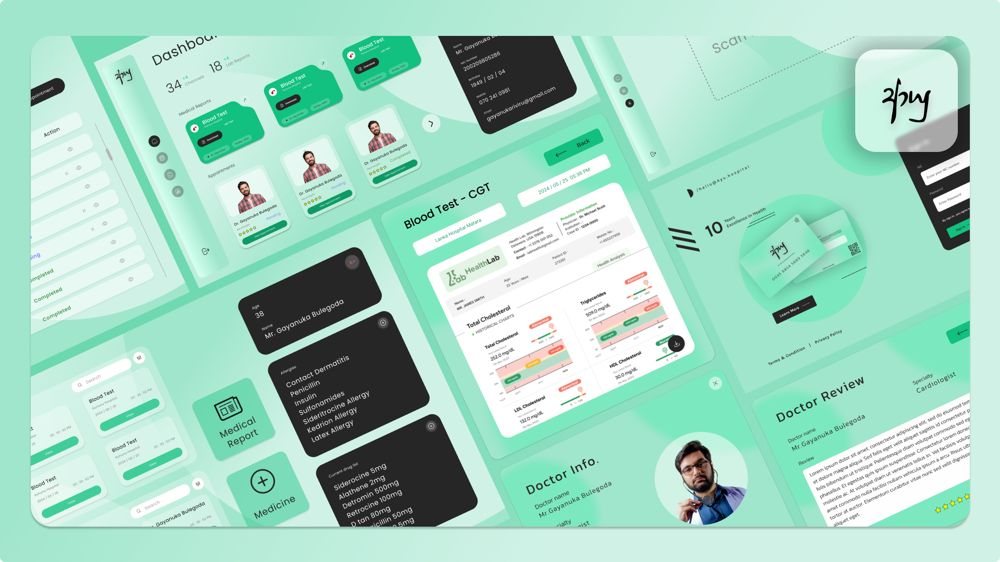

<a id="readme-top"></a>

<div align="center">

[![Contributors][contributors-shield]][contributors-url]
[![Closed Pull Requests][closed-pull-requests-shield]][closed-pull-requests-url]
[![Stargazers][stars-shield]][stars-url]
[![Issues][issues-shield]][issues-url]
[![MIT License][license-shield]][license-url]

</div>

<!-- PROJECT LOGO -->
<br />
<div align="center">
  <a href="https://github.com/YourOrg/Project-Ayu-Frontend">
    
  </a>

<h2 align="center">Project Ayu Frontend</h2>

  <p align="center">
    Welcome to the <strong>Project Ayu Frontend</strong> repository! This repository hosts the user interface for Project Ayu, a cutting-edge patient medical data management system that streamlines access to medical records, appointment scheduling, telemedicine, AI-driven predictive analytics, and more using NFC integration.
    <br />
    <a href="https://github.com/Darko-Innovex/Project-Ayu-Frontend/tree/main/src"><strong>Explore the project »</strong></a>
    <br />
    <br />
    <a href="https://github.com/Darko-Innovex/Project-Ayu-Frontend/issues/new?labels=bug">Report Bug</a>
    ·
    <a href="https://github.com/Darko-Innovex/Project-Ayu-Frontend/issues/new?labels=enhancement">Request Feature</a>
  </p>
</div>

<!-- TABLE OF CONTENTS -->
<details>
  <summary>Table of Contents</summary>
  <ol>
    <li>
      <a href="#about-the-project">About The Project</a>
      <ul>
        <li><a href="#built-with">Built With</a></li>
      </ul>
    </li>
    <li>
      <a href="#getting-started">Getting Started</a>
      <ul>
        <li><a href="#prerequisites">Prerequisites</a></li>
        <li><a href="#installation">Installation</a></li>
      </ul>
    </li>
    <li>
      <a href="#backend-repository">Backend Repository</a>
    </li>
    <li><a href="#top-contributors">Top Contributors</a></li>
    <li><a href="#license">License</a></li>
  </ol>
</details>

<!-- ABOUT THE PROJECT -->
## About The Project



Project Ayu is a revolutionary patient medical data management system designed to integrate medical records across multiple hospitals. With NFC card integration, secure data management, telemedicine support, and AI-driven predictive insights, Project Ayu aims to improve healthcare delivery and patient outcomes.

**User Interface Features**:
- **Responsive Design**: Clean and responsive UI built with modern web technologies.
- **Patient Portal**: Easy-to-use dashboard for patients to access their medical history, manage appointments, and receive notifications.
- **Healthcare Provider Interface**: Dedicated views for doctors and hospital staff to update and manage patient records securely.
- **Real-Time Updates**: Dynamic components for live notifications, appointment scheduling, and updates.
- **Secure Access**: Frontend integrated with robust authentication and authorization mechanisms.

<p align="right">(<a href="#readme-top">back to top</a>)</p>

### Built With

This project is built with the following technologies:

* [![React][React.com]][React-url] <!-- Optional: if using React -->
* [![CSS][CSS.com]][CSS-url]
* [![JavaScript][JavaScript.com]][JavaScript-url]
* [![Axios][Axios.com]][Axios-url]
* [][Chart-js-url]

<p align="right">(<a href="#readme-top">back to top</a>)</p>

<!-- GETTING STARTED -->
## Getting Started

Follow these steps to set up the Project Ayu frontend on your local machine.

### Prerequisites

Ensure you have the following installed:

* **Node.js & npm**

Other dependencies are included in the project.

### Installation

1. **Clone the repository**
   ```sh
   git clone https://github.com/YourOrg/Project-Ayu-Frontend.git
   ```

2. **Navigate to the project directory**
   ```sh
   cd Project-Ayu-Frontend
   ```

3. **Install dependencies**
   ```sh
   npm install
   ```

4. **Run the application**
   ```sh
   npm start
   ```

<p align="right">(<a href="#readme-top">back to top</a>)</p>

## Backend Repository

The backend services for Project Ayu are managed in a separate repository:
[Project Ayu Backend](https://github.com/Darko-Innovex/Project-Ayu-Backend)

<p align="right">(<a href="#readme-top">back to top</a>)</p>

## Project Documentation

For detailed information on the project requirements and system design, please refer to the following documents:
- [Project Ayu Proposal](./src/docs/Project_Ayu_Proposal.pdf)
- [Project Ayu SRS](./src/docs/Project_Ayu_SRS.pdf)

<p align="right">(<a href="#readme-top">back to top</a>)</p>

## Top Contributors

<a href="https://github.com/YourOrg/Project-Ayu-Frontend/graphs/contributors">
  
</a>

<p align="right">(<a href="#readme-top">back to top</a>)</p>

## License

Distributed under the MIT License. See [LICENSE](LICENSE) for more information.

<p align="right">(<a href="#readme-top">back to top</a>)</p>

<p align="center">
  &copy; 2024 Project Ayu
</p>

<!-- MARKDOWN LINKS & IMAGES -->
[contributors-shield]: https://img.shields.io/github/contributors/Darko-Innovex/Project-Ayu-Frontend.svg?style=for-the-badge
[contributors-url]: https://github.com/Darko-Innovex/Project-Ayu-Frontend/graphs/contributors
[closed-pull-requests-shield]: https://img.shields.io/github/issues-pr-closed/Darko-Innovex/Project-Ayu-Frontend.svg?style=for-the-badge
[closed-pull-requests-url]: https://github.com/Darko-Innovex/Project-Ayu-Frontend/pulls?q=is%3Apr+is%3Aclosed
[stars-shield]: https://img.shields.io/github/stars/Darko-Innovex/Project-Ayu-Frontend.svg?style=for-the-badge
[stars-url]: https://github.com/Darko-Innovex/Project-Ayu-Frontend/stargazers
[issues-shield]: https://img.shields.io/github/issues/Darko-Innovex/Project-Ayu-Frontend.svg?style=for-the-badge
[issues-url]: https://github.com/Darko-Innovex/Project-Ayu-Frontend/issues
[license-shield]: https://img.shields.io/github/license/Darko-Innovex/Project-Ayu-Frontend.svg?style=for-the-badge
[license-url]: https://github.com/Darko-Innovex/Project-Ayu-Frontend/blob/main/LICENSE
[CSS.com]: https://img.shields.io/badge/CSS-1572B6?style=for-the-badge&logo=css3&logoColor=white
[CSS-url]: https://developer.mozilla.org/en-US/docs/Web/CSS
[JavaScript.com]: https://img.shields.io/badge/JavaScript-F7DF1E?style=for-the-badge&logo=javascript&logoColor=black
[JavaScript-url]: https://developer.mozilla.org/en-US/docs/Web/JavaScript
[Axios.com]: https://img.shields.io/badge/Axios-5A29E4?style=for-the-badge&logo=axios&logoColor=white
[Axios-url]: https://axios-http.com/
[Bootstrap.com]: https://img.shields.io/badge/Bootstrap-563D7C?style=for-the-badge&logo=bootstrap&logoColor=white
[Bootstrap-url]: https://getbootstrap.com
[React.com]: https://img.shields.io/badge/React-61DAFB?style=for-the-badge&logo=react&logoColor=black
[React-url]: https://reactjs.org
[Chart-js-url]: https://www.chartjs.org/
